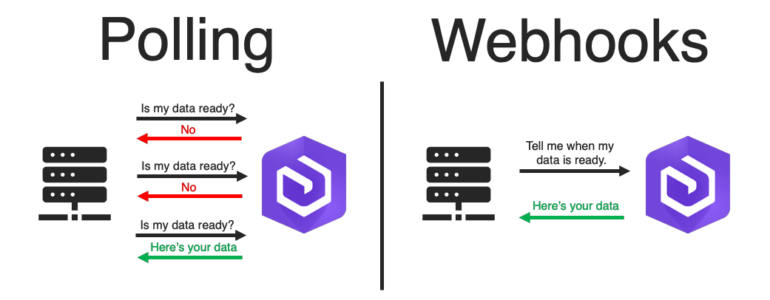
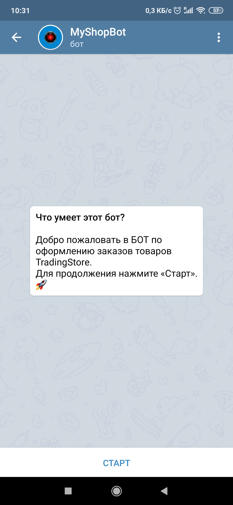
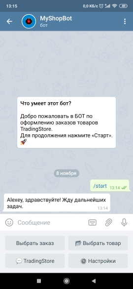
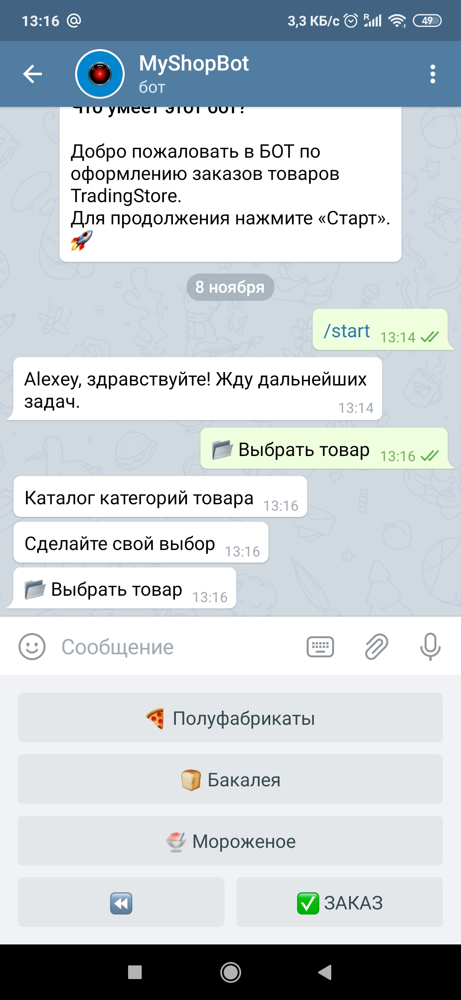
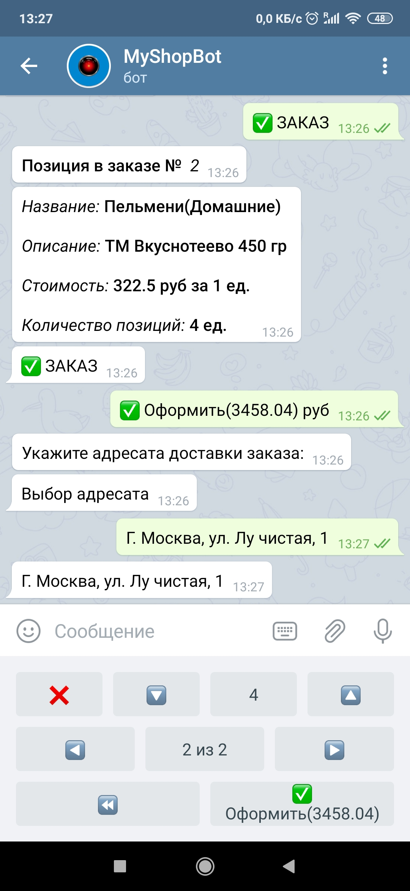
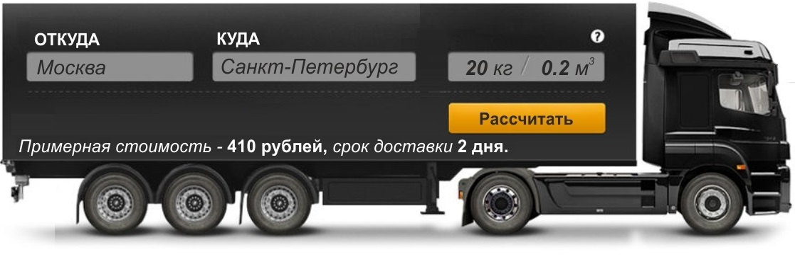
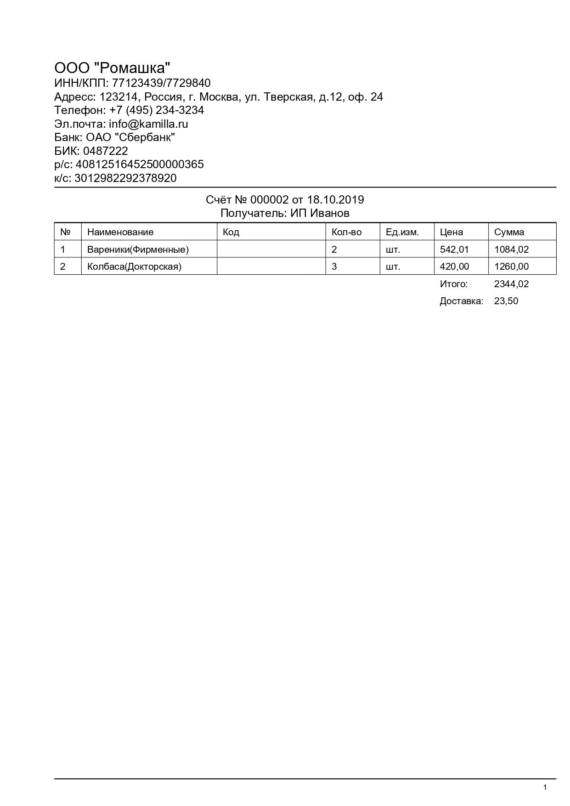

## Оглавление

1. [Основные возможности](#общие-сведения)
    1. [общие сведения](#общие-сведения)
    2. [работа на polling и webhook](#работа-на-polling-и-webhook)
    3. [авторизация пользователей](#авторизация-пользователей)
    4. [возможности пользователей](#возможности-пользователей)
    5. [формирование заказа](#формирование-заказа)
    6. [расчет стоимости заказа с учетом логистики](#расчет-стоимости-заказа-с-учетом-логистики)
    7. [отправка счета клиенту в формате PDF по e-mail](#отправка-счета-клиенту-в-формате-PDF-по-e-mail)
2. [Стек технологий и модули](#Стек-технологий-и-модули)
3. [Регистрация бота](#Регистрация-бота)
4. [Установка и отладка](#Установка-и-отладка)

------------
## Основные возможности

## общие сведения

>Чат-боты – это некий помощник, который общается с пользователями посредством сообщений и обладает множеством специфичных функций. Чат - бота можно использовать как для рассылки информации, так и для ее сбора. На сегодняшний день мессенджеры пользуются большим спросом, это связано c изменением в области мобильного интернета: высокие скорости, низкая цена и широкое распространение смартфонов. Прогрессивность мессенджеров можно сравнить с явлением десятилетней давности – взрывом социальных медиа. Уже сейчас приложениями для обмена сообщениями пользуются 2 миллиарда человек, и если верить прогнозам, к 2021 году число пользователей увеличится до 2,48 миллиардов.Чат-боты – это некий помощник, который общается с пользователями посредством сообщений и обладает множеством специфичных функций. Чат - бота можно использовать как для рассылки информации, так и для ее сбора.

>На сегодняшний день мессенджеры пользуются большим спросом, это связано c изменением в области мобильного интернета: высокие скорости, низкая цена и широкое распространение смартфонов. Прогрессивность мессенджеров можно сравнить с явлением десятилетней давности – взрывом социальных медиа. Уже сейчас приложениями для обмена сообщениями пользуются 2 миллиарда человек, и если верить прогнозам, к 2021 году число пользователей увеличится до 2,48 миллиардов. 

<b>TradingStoreBot</b> — это бот, цель которого заключается в принятии заказа торговым представителем от клиентов фирмы, с последующим формированием заказа, где будет рассчитана стоимость заказа с учетом логистики товара относительно дислокации клиента от склада. В последствии сформированный заказ будет направлен кладовщику для организации дальнейшей загрузки товара и доставки клиенту. В боте реализована возможность авторизации, с целью распределения обязанностей для бота и иные особенности о котором будет сказано ниже.

[🔼Оглавление](#Оглавление)

## работа на polling и webhook

В документации Telegram Bot API выделяется два диаметрально противоположных способа получения обновлений: c помощью периодических запросов или установка вебхуков. Входящие обновления хранятся до тех пор, пока сервер не обработает его, но не дольше 24 часов. Независимо от способа получения обновлений, в ответ получаем объект Update, сериализованный в JSON.

Первый и наиболее простой вариант заключается в периодическом опросе серверов Telegram на предмет наличия новой информации. Всѐ это осуществляется через т.н. Long Polling, т.е. открывается соединение на непродолжительное время и все обновления тут же отправляются боту. Просто, но не очень надежно. Во-первых, серверы Telegram периодически начинают возвращать ошибку 504 (Gateway Timeout), из-за чего некоторые боты впадают в ступор. Во-вторых, если одновременно запущено несколько ботов, вероятность столкнуться с ошибками возрастает.

Webhooks работают несколько иначе. Под установкой вебхука подразумевается, что теперь если в чат приходит сообщение, то Telegram сам говорит об этом. Отпадает необходимость периодически опрашивать серверы, тем самым, исчезает причина падений ботов. Однако за это приходится платить необходимостью установки полноценного веб-сервера на ту машину, на которой планируется запускать ботов. Так же для работы надо иметь собственный SSL-сертификат (Secure Sockets Layer), т.к. webhooks в Telegram работают только по HTTPS

**В @TradingStoreBot реализованно два вышеперечисленных подхода по запуску бота.**

[🔼Оглавление](#Оглавление)

## авторизация пользователей

Авторизация пользователя в боте реализована следующим образом: при первичном добавлении бота, пользователь должен отправить ему команду /start (это стандартно и предусмотрено Telegram). Следующим шагом, пользователь обязательно должен ввести выданный ему пароль администратором - это и есть авторизация на сервере. В данный момент в БД происходит сохранение chat_id и usre_name.

Если у пользователя нет пароля, ему будет предложено связаться с директор/администратор по номеру телефона или отправить администратору бота сообщение с просьбой связаться с пользователем.

[🔼Оглавление](#Оглавление)

## возможности пользователей

В приложении концептуально предусмотрено три вида пользователей с разным функционалом: Торговый представитель (Trading), Кладовщик (Storekeeper) и Администратор (Administrator). На данный момент реализовано позиция Торгового представителя и Кладовщика, Администратор является опциональной составляющей. 

### **торговый представитель**

Торговый представитель наделен функцией по формированию заказа, на основании потребности клиента, а именно:
- выбор категории товара;
- выбор товара в категории;
- выбор количества товара по позициям;
- сбор данных о локации клиента/адрес доставки;
- формирование заказа с учетом стоимости логистики товара от склада поставщика до дислокации клиента;
- редактирование заказа до подтверждения от ТП;
- фиксация даты доставки товара клиенту и его адрес;
- сформированный заказ направляется в БД (таблицу заказа) → на сервер TelBot →
кладовщику

### **кладовщик**

Кладовщик принимает сформированный заказ, на основании которого осуществляет загрузку ТС для развозки товара.

- получает сообщение с данными о сформированном заказе:
    - номенклатура товара;
    - количество товара (единицы/штуки/полеты);
    - адрес доставки товара;
    - дата и время доставки товара.
    - особые отметки.
- подтверждает загрузку товара указанного в заказе.

После подтверждения сформированного заказа, на сервере форматируется счет в PDF формате → отправляет на почту клиенту.
(сли почты нет, сохраняет в базе).

### **Администратор(опциональное решение)**

Администратор имеет доступ к данным по сформированному заказу, подтверждению факта формирования загрузки и анализа статистики по каждому клиенту (может сформировать выборку за необходимый период).

- данные по сформированным заказам;
- данные по загрузки ТС для развозки;
- аналитические данные по клиентам;
- аналитические данные по сотрудникам ТП;

Можно формировать аналитику не только по клиенту, но и по каждому из сотрудников ТП/кладовщику и т. п.

[🔼Оглавление](#Оглавление)

## формирование заказа

Ключевое значение в приложении играет формирование заказа, поскольку в нем сосредоточены основные данные по заказанному товару и клиенту, а именно: 

- номенклатура товара;
- количество товара (единицы/штуки/полеты);
- адрес доставки товара;
- дата и время доставки товара;
- стоимость;
- особые отметки.

[🔼Оглавление](#Оглавление)

## расчет стоимости заказа с учетом логистики

В приложении реализован расчет стоимости заказа с учетом расстояния между адресом доставки и расположением склада. За основу был взят модуль [geopy](https://geopy.readthedocs.io/en/stable/ "geopy").

- в настройках проекта указано условное местоположение склада, отправительная точка для расчета расстояния между объектами;
- в настройках проекта указан условный коэффициент стоимости, из расчета за каждый 1 км - 10 рублей.

На основании указанных параметров и будет производиться окончательная стоимость стоимость заказа.

[🔼Оглавление](#Оглавление)

## отправка счета клиенту в формате PDF по e-mail

После того, как заказ будет сформирован и подтвержден кладовщиком, в приложении формируется накладная в формате PDF и направляется на e-mail клиенту, при помощи модулей [email](https://docs.python.org/3/library/email.html#module-email "email") и [smtplib](https://docs.python.org/3/library/smtplib.html#module-smtplib "smtplib").

[🔼Оглавление](#Оглавление)

## Стек технологий и модули

1) [python3](https://www.python.org/ "python3") — высокоуровневый язык программирования, ориентированный на повышение производительности разработчика и читаемости кода. 

2) [pyTelegramBotAPI](https://github.com/eternnoir/pyTelegramBotAPI "pyTelegramBotAPI") — простая, но расширяемая реализация Python для Telegram Bot AP.

3) [SQLite3](https://docs.python.org/2/library/sqlite3.html "SQLite3") – это автономный, работающий без сервера транзакционный механизм базы данных SQL.

4) [SQLAlchemy](https://www.sqlalchemy.org/ "SQLAlchemy") — это программное обеспечение с открытым исходным кодом для работы с базами данных при помощи языка SQL. Оно реализует технологию программирования ORM (Object-Relational Mapping), которая связывает базы данных с концепциями объектно-ориентированных языков программирования. SQLAlchemy позволяет описывать структуры баз данных и способы взаимодействия с ними прямо на языке Python.

5) [geopy](https://geopy.readthedocs.io/en/stable/ "geopy") — позволяет разработчикам Python легко находить координаты адресов, городов, стран и ориентиров по всему миру, используя сторонние геокодеры и другие источники данных.

6) [emoji](https://pypi.org/project/emoji/ "emoji") — для Python.

7) [reportlab](https://www.reportlab.com/ "reportlab") - это open source (BSD license) библиотека, позволяющая создавать PDF-документы любой сложности напрямую из Python’a.

[🔼Оглавление](#Оглавление)

>
ВНИМАНИЕ !

Token – единственный идентификационный ключ к боту. Нигде не выкладывайте его, иначе другие люди смогут управлять Вашим ботом. Бот с данным token на момент выкладывания статьи удалён.

